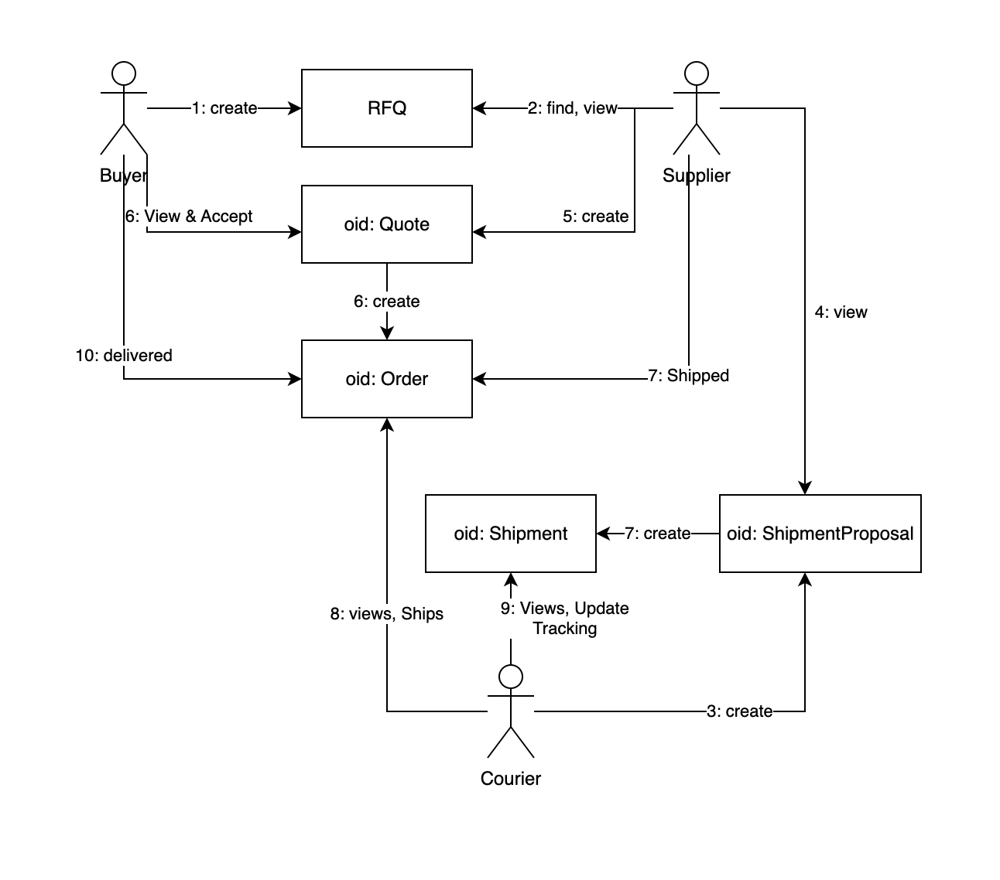

## Project

This is an attempt to model a simple Manufacturing Reverse marketplace as a set of smart contracts.

### What is a reverse-marketplace? 

In a classic marketplace the suppliers publish their products for sale while buyers are actively searching for products. Product catalogs are usually predefined and the product selection does not change fundamentally. 

In a reverse-marketplace, there is no predefined product catalog. The buyers have needs for a product/services to be manufactured/served by suppliers. Buyers publish their RFQ (request for quote) on the marketplace, and thus creating a dynamic "product catalog" on the marketplace.
Examples are manufacturing marketplace for parts, contracting services marketplaces.

### Why is it suitable for DAML and DLT? 

B2B Manufacturing and wholesale marketplaces could get more complicated because there could be many other actors participating in the workflows - creditors, couriers, insurers, warehouses, etc, and consequently the workflows are more complicated and could vary a lot when many parties are involved. 

The main issues between all of the actors are trust, privacy, confidence. They all need assurance that everyone in the workflow is trustworthy, transactions are private but transparent, and that the outcomes are predictable and fair. Even more, since the order values are fairly high -- 1K, 100K, or more. 

Having clear, fast and automated contracts improves the efficiency of all participants businesses.

## Workflow 

Here, we'll consider only a simple workflow involving shipment via courier. This includes concepts such as RFQ, Quote, Order, Shipment. Handling Payments are excluded, although it would be very interesting to explore later.

Actors:
 * buyer 
 * supplier
 * courier

Concepts:
 * RFQ - request for quote - created by Buyer, describes what the buyer whats manufactured and how much of it, and various details. 
 * Quote - always based on a RFQ, what a supplier can fulfill from a RFQ, fully or partially, and its cost and delivery estimates
 * Order - Buyer's order to a supplier based on a Quote. This is the actual final contract between parties for delivery of goods. It includes also the shipping contract, and clear conditions.

### Communication Diagram of a typical workflow 

1. Buyer creates RFQ and makes it visible to  Suppliers he prefers 
2. Supplier considers and estimates a quote
X. Asks Courier for a shipment offer -- this is omitted from the model
3. Courier provides a shipment proposal (draft contract) to be included in the quote and visible to supplier, and buyer
4. Supplier reviews and includes the shipment proposal in the quote
5. Supplier Creates a quote with a draft order contract including the shipment proposal
6. Buyer reviews the quote, the total costs and Accepts the Quote, which creates a Quote. 
7. Supplier manufactures the Order, and when done invokes Shipping of Order, which turns the contract on and 
8. Courier takes care of the delivery 
9. Courier updates tracking information in the Shipment
10. Buyer receives the shipment and triggers delivered on the Order

This is workflow is reproduced in the test cases here: [Workflow Test cases](daml/Test.daml)

## Ideas for further work

 * implement locked credit for RFQ to prove the availability of funds for the RFQ and payments
 * include creditor as a provider of funds for RFQ 
 * implement "sample order" as a pre-requisite for a supplier to receive a full order and full payment
 

